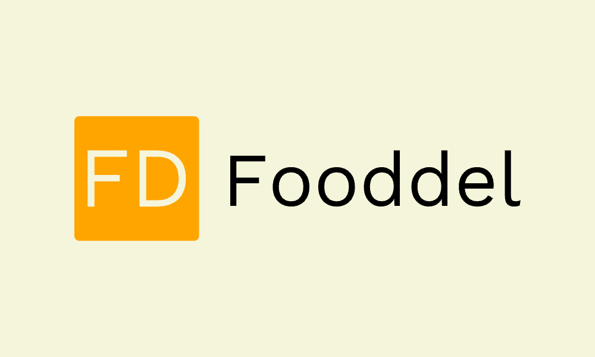
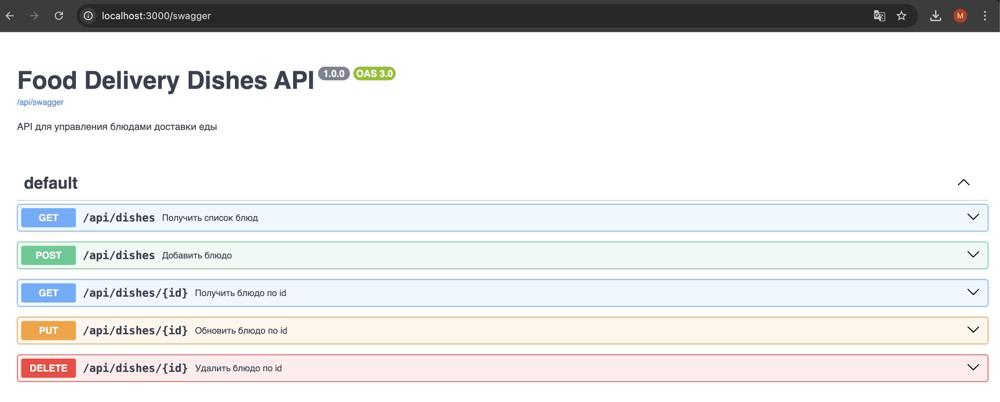

<p align="center">
	
</p>

<h1 align="center">Fooddel</h1>

<p align="center">
	<a href="https://github.com/PierreDioJ/Fooddel"></a>
	<a href="https://img.shields.io/github/last-commit/PierreDioJ/Fooddel"></a>
	<a href="https://img.shields.io/github/issues/PierreDioJ/Fooddel"></a>
</p>

---

## Введение

Fooddel — это API для управления блюдами сервиса доставки еды. Проект позволяет получать, добавлять, изменять и удалять блюда через HTTP-запросы. Реализован на Next.js.

---

## Необходимые условия

- Node.js >= 18.x
- npm >= 9.x
- ОС: Windows, macOS или Linux

---

## Установка

1. Клонируйте репозиторий:
	 ```bash
	 git clone https://github.com/PierreDioJ/Fooddel.git
	 cd Fooddel/fooddel
	 ```
2. Установите зависимости:
	 ```bash
	 npm install
	 ```
3. Запустите проект:
	 ```bash
	 npm run dev
	 ```

---

## Порядок использования

После запуска API будет доступен по адресу `http://localhost:3000`.

### Основные эндпоинты:

- `GET /api/dishes` — получить список блюд
- `POST /api/dishes` — добавить блюдо (name, price)
- `GET /api/dishes/{id}` — получить блюдо по id
- `PUT /api/dishes/{id}` — обновить блюдо
- `DELETE /api/dishes/{id}` — удалить блюдо

### Пример запроса

```bash
curl -X POST http://localhost:3000/api/dishes \
	-H "Content-Type: application/json" \
	-d '{"name": "Паста Болоньезе", "price": 700}'
```

### Swagger UI

Для удобной работы с API и просмотра документации перейдите на [http://localhost:3000/swagger](http://localhost:3000/swagger)

---

## Скриншот



---